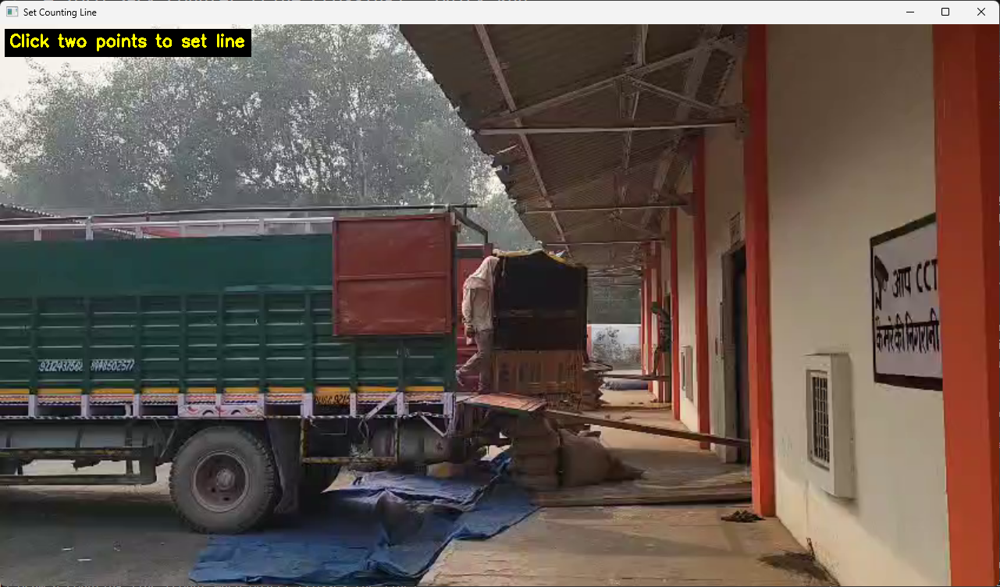
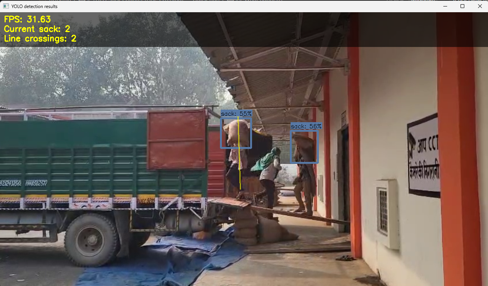
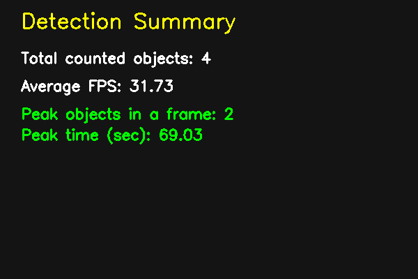
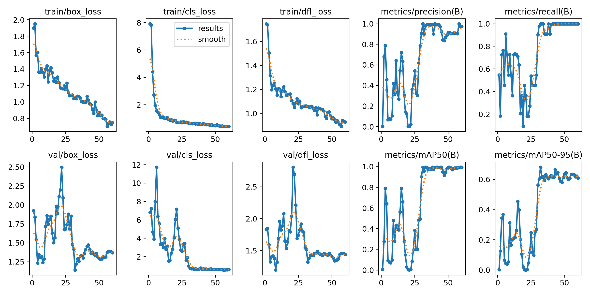

# Sack Counting with YOLO (Line‑Crossing + Confidence Mode)

A simple, practical sack counter built on **Ultralytics YOLO11s**.  
Supports **interactive line‑crossing counting** (best for conveyor/entry‑exit counting) and **confidence mode** for quick checks.

---

## Demo (Step‑by‑step)

### 1) Draw the counting line (Option 1)



### 2) Live detection + counting overlay



### 3) End‑of‑run summary



---

## Model metrics (training graphs)

Metrics & training curves are available in `model-metrics/`:



---

## Requirements

- Python 3.9+ recommended
- `ultralytics`, `opencv-python`, `numpy`

Install:

```bash
pip install ultralytics opencv-python numpy
```

---

## Run

### Video

```bash
python yolo_detect.py --model my_model.pt --source ./video/video3.mp4 --resolution 1280x720 --thresh 0.5
```

### USB camera

```bash
python yolo_detect.py --model my_model.pt --source usb0 --resolution 1280x720 --thresh 0.5
```

---

## Counting modes (you choose at startup)

When you start the script, it asks:

1. **Draw a line**: counts **+1** only when a sack crosses the line (recommended).
2. **Confidence mode**: displays boxes using `--thresh`, but counts only if confidence is **≥ 0.80**.

---

## Arguments

- `--model` **(required)**: path to `.pt` file (example: `my_model.pt`)
- `--source` **(required)**: video path, image, folder, or camera index like `usb0`
- `--resolution`: `WxH` (recommended for video/camera), example `1280x720`
- `--thresh`: **display** confidence threshold (default `0.5`). You can pass `0.8` or `80` (percent).
- `--record`: saves an output video as `demo1.avi` (requires `--resolution`)

> Note: This project uses a **single‑class model (`sack`)**.

---

## Controls

### Main window

- `q`: quit
- `s`: pause (press any key to resume)
- `p`: save a screenshot as `capture.png`
- `l`: redraw the counting line (line mode only)

### Set Counting Line window

- **Left‑click**: set point 1 and point 2 for the line
- `Enter`: confirm line (after 2 clicks)
- `Esc`: cancel line setup

---

## Outputs

- `detection_log.csv`: per‑frame `timestamp_sec` and `object_count`
- `detection_summary.png`: end‑of‑run summary image

---

## Folder notes

- `model-metrics/`: screenshots + training metrics graphs (shown above)
- `video/`: sample videos
- `train/`: YOLO training artifacts/curves (if present)

